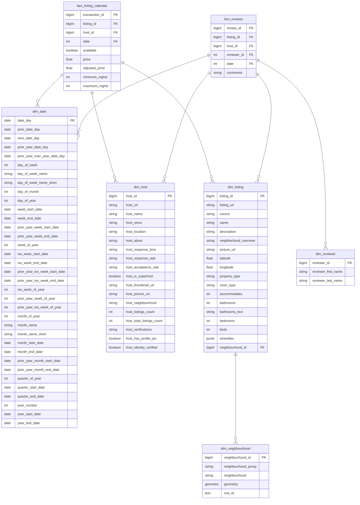
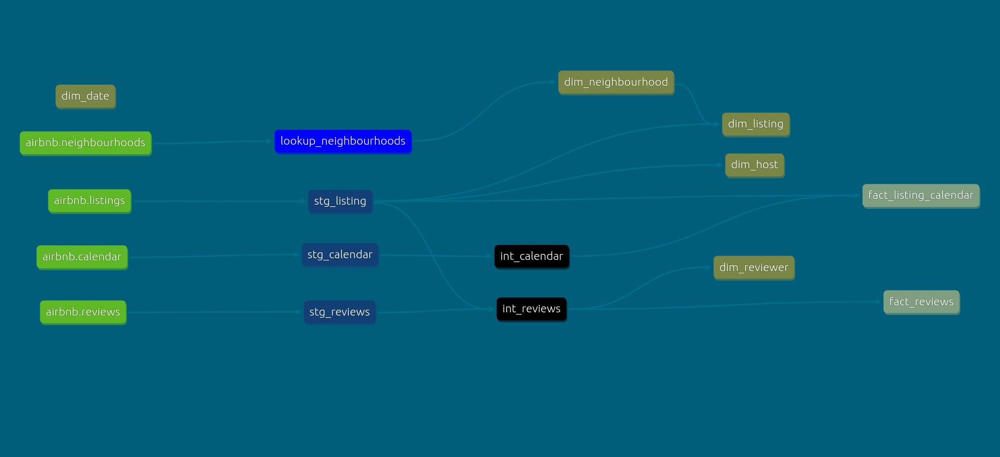

## Introduction
The primary goal of this project is to analyze Airbnb listings data for Barcelona, allowing us to construct a data warehouse (DW) that can efficiently support various business queries. By utilizing the dataset, we aim to extract insights that address specific business questions, enabling stakeholders to make informed decisions based on the data.                  
> For more information about this task, check [this repo](https://github.com/ahmedshaaban1999/Data_Engineering_Mentorship/tree/main/level_1/Data_Modeling/projects/airbnb) 

## Business Questions

To further guide the analysis, several specific business questions are posed, such as:

- **Identifying the cheapest**, **most available** listing in October 2024.
- **Determining which listings** received the most reviews in October 2024.
- **Identifying the most** expensive neighborhood in Barcelona.
- **Providing tailored recommendations** for specific user profiles based on their needs and budget.


## Key Deliverables

The project is structured around two key deliverables:

- **Data Warehouse Schema:** A well-defined schema that enables efficient data storage and retrieval.
- **Business Question Answers:** SQL queries that answer the specified business questions, providing insights and recommendations based on the data.                                     
> Check: `./notebook.ipynb` to see results.
    
## Prerequisites:
- Docker & Docker Compose installed
- Python 3.9+
- Linux os (Ubuntu 22.04.5 LTS x86_64 was used in this project)
- gunzip (gzip) 1.10

## How to run

To start, run `sh setup.sh` that handles the following tasks:

- **Data Directory Setup**: Creates a directory structure to organize raw data files.
- **Data Downloading:** Fetches essential CSV and GeoJSON files from the Inside Airbnb website, which includes listings, calendar data, reviews, and geographical data about neighborhoods.
- **Data Uncompression:** Decompresses the downloaded files for further processing.             

Subsequently, another script (`load_source_data.py`) is used to load this data into a PostgreSQL database. This script:

- **Reads** CSV files in chunks to avoid memory issues and processes each chunk before loading it into the database. Special handling is included for price fields to ensure they are stored in a numerical format.
- **Loads** GeoJSON files directly into the database as well, allowing spatial queries to be performed on geographical data.

### profiles.yml
Copy these configurations to your `profiles.yml` 
```yml
# /path/to/profiles.yml
dbt_model:
  outputs:
    dev:
      dbname: bnb
      host: localhost
      pass: passw0rd
      port: 5432
      schema: dwh
      threads: 1
      type: postgres
      user: ahmad
  target: dev
```

## DWH Schema
The schema is designed using an Entity-Relationship Diagram (ERD) that visually represents the relationships between the various tables in the data warehouse. This diagram serves as a blueprint for how data is organized and how different entities interact, making it easier for developers and analysts to understand the structure of the database.
- **Fact Tables**: These contain transactional data related to **listings** and **reviews**, allowing for performance-oriented querying.
- **Dimension Tables**: These provide context to the facts, such as details about hosts, listings, and dates. They enhance the analytical capabilities of the data warehouse by allowing more intuitive filtering and grouping in queries.


# Indexes
```sql
-- get all indexes
SELECT 
	indexname, tablename, indexdef 
FROM
	pg_indexes
WHERE
	tablename NOT LIKE '%pg_%';
```
|indexname                       | tablename           | indexdef                                                                                                       |
|--------------------------------|---------------------|----------------------------------------------------------------------------------------------------------------|
|b47ca2c71bbf79c149e50f82360c1a30|fact_listing_calendar|CREATE INDEX b47ca2c71bbf79c149e50f82360c1a30 ON dwh.fact_listing_calendar USING btree (host_id)                |
|ab034c2146c34375f98796a5b4ea229f|fact_listing_calendar|CREATE INDEX ab034c2146c34375f98796a5b4ea229f ON dwh.fact_listing_calendar USING btree (listing_id)             |
|65a70554ccc824840054de78d7581d9c|fact_reviews         |CREATE UNIQUE INDEX "65a70554ccc824840054de78d7581d9c" ON dwh.fact_reviews USING btree (review_id)              |
|ee56c6477276f5407de4485a57754ffe|fact_reviews         |CREATE INDEX ee56c6477276f5407de4485a57754ffe ON dwh.fact_reviews USING btree (listing_id)                      |
|35572801a31f3775a8dcf64deec3b34d|fact_reviews         |CREATE INDEX "35572801a31f3775a8dcf64deec3b34d" ON dwh.fact_reviews USING btree (date)                          |
|2b7379686737470c8027de03a3350dd3|fact_listing_calendar|CREATE UNIQUE INDEX "2b7379686737470c8027de03a3350dd3" ON dwh.fact_listing_calendar USING btree (transaction_id)|
|2c2acd339d6cc5c6ae573182f6168998|fact_listing_calendar|CREATE INDEX "2c2acd339d6cc5c6ae573182f6168998" ON dwh.fact_listing_calendar USING btree (date)                 |
|spatial_ref_sys_pkey            |spatial_ref_sys      |CREATE UNIQUE INDEX spatial_ref_sys_pkey ON public.spatial_ref_sys USING btree (srid)                           |
|calendar_pkey                   |calendar             |CREATE UNIQUE INDEX calendar_pkey ON public.calendar USING btree (calendar_id)                                  |
|listings_pkey                   |listings             |CREATE UNIQUE INDEX listings_pkey ON public.listings USING btree (listing_id)                                   |
|reviews_pkey                    |reviews              |CREATE UNIQUE INDEX reviews_pkey ON public.reviews USING btree (id)                                             |
|idx_neighbourhoods_geometry     |neighbourhoods       |CREATE INDEX idx_neighbourhoods_geometry ON public.neighbourhoods USING gist (geometry)                         |
|neighbourhoods_pkey             |neighbourhoods       |CREATE UNIQUE INDEX neighbourhoods_pkey ON public.neighbourhoods USING btree (neighbourhood_id)                 |
|listing_id_index                |calendar             |CREATE INDEX listing_id_index ON public.calendar USING btree (listing_id)                                       |
|e497a45d165deadc305a0d54606e39a3|stg_calendar         |CREATE INDEX e497a45d165deadc305a0d54606e39a3 ON dwh.stg_calendar USING btree (listing_id)                      |
|5c5ce213de8a4c42f9ed0b2801a082f0|stg_calendar         |CREATE INDEX "5c5ce213de8a4c42f9ed0b2801a082f0" ON dwh.stg_calendar USING btree (date)                          |
|idx_calendar_calendar_id        |calendar             |CREATE INDEX idx_calendar_calendar_id ON public.calendar USING btree (calendar_id)                              |
|idx_stg_calendar_calendar_id    |stg_calendar         |CREATE INDEX idx_stg_calendar_calendar_id ON dwh.stg_calendar USING btree (calendar_id)                         |
|48b77c4eaf39d6d88bd5d4fe7bd0e9c4|stg_listing          |CREATE UNIQUE INDEX "48b77c4eaf39d6d88bd5d4fe7bd0e9c4" ON dwh.stg_listing USING btree (listing_id)              |
|4d0b61d54db7236abbe979709950dca9|stg_listing          |CREATE INDEX "4d0b61d54db7236abbe979709950dca9" ON dwh.stg_listing USING btree (host_id)                        |
|a0ee75e8087c43f9eff6ba0a3aee2ffc|stg_reviews          |CREATE INDEX a0ee75e8087c43f9eff6ba0a3aee2ffc ON dwh.stg_reviews USING btree (listing_id)                       |
|bce41e3324b594ab192e1df37ba4ecf3|stg_reviews          |CREATE INDEX bce41e3324b594ab192e1df37ba4ecf3 ON dwh.stg_reviews USING btree (date)                             |
|12d0a411e31713e14e70940c15def0d3|stg_reviews          |CREATE UNIQUE INDEX "12d0a411e31713e14e70940c15def0d3" ON dwh.stg_reviews USING btree (id)                      |
|c1bbcdf35276f157f17ca15ff48394f8|lookup_neighbourhoods|CREATE UNIQUE INDEX c1bbcdf35276f157f17ca15ff48394f8 ON dwh.lookup_neighbourhoods USING btree (row_id)          |
|94766b7d6bfde9daf3060f2a44d6f024|int_calendar         |CREATE INDEX "94766b7d6bfde9daf3060f2a44d6f024" ON dwh.int_calendar USING btree (date)                          |
|d5db3a0ca042b2c3c24c558880464adc|int_calendar         |CREATE INDEX d5db3a0ca042b2c3c24c558880464adc ON dwh.int_calendar USING btree (listing_id)                      |
|0775817a40e5bbda516c4ebbcd5d3a21|int_calendar         |CREATE UNIQUE INDEX "0775817a40e5bbda516c4ebbcd5d3a21" ON dwh.int_calendar USING btree (calendar_id)            |
|16821200b1fb98615fbd8acf6e8b63c9|int_reviews          |CREATE UNIQUE INDEX "16821200b1fb98615fbd8acf6e8b63c9" ON dwh.int_reviews USING btree (id)                      |
|733f0dfe6563099fd3e3676975dbcaf5|int_reviews          |CREATE INDEX "733f0dfe6563099fd3e3676975dbcaf5" ON dwh.int_reviews USING btree (listing_id)                     |
|e12fedb79248396f914fe600b83a7eca|int_reviews          |CREATE INDEX e12fedb79248396f914fe600b83a7eca ON dwh.int_reviews USING btree (date)                             |
|5f935161f72a4e86302efa35e383ccf6|int_reviews          |CREATE INDEX "5f935161f72a4e86302efa35e383ccf6" ON dwh.int_reviews USING btree (reviewer_id)                    |
|82b66efabe531496dff3655d77e0813d|int_neightbourhoods  |CREATE UNIQUE INDEX "82b66efabe531496dff3655d77e0813d" ON dwh.int_neightbourhoods USING btree (neighbourhood_id)|
|84239050b3881a5b6f9a30c0e7fc7c2e|dim_host             |CREATE UNIQUE INDEX "84239050b3881a5b6f9a30c0e7fc7c2e" ON dwh.dim_host USING btree (host_id)                    |
|6db72efda871c89e12f37d7f63c644ad|dim_neighbourhood    |CREATE UNIQUE INDEX "6db72efda871c89e12f37d7f63c644ad" ON dwh.dim_neighbourhood USING btree (neighbourhood_id)  |
|70487ef70e9d6c13b7e82dd08692915e|dim_reviewer         |CREATE INDEX "70487ef70e9d6c13b7e82dd08692915e" ON dwh.dim_reviewer USING btree (reviewer_id)                   |
|7d8a5bf931e4534492b2fca909a4c8f2|dim_listing          |CREATE UNIQUE INDEX "7d8a5bf931e4534492b2fca909a4c8f2" ON dwh.dim_listing USING btree (listing_id)              |
|67d8298dc467eeb22def2bcd17f54eb5|dim_listing          |CREATE INDEX "67d8298dc467eeb22def2bcd17f54eb5" ON dwh.dim_listing USING btree (neighbourhood_id)               |


# Lineage Diagram
The lineage diagram provides a visual representation of the flow of data through various stages of the data pipeline, illustrating how raw data transforms into actionable insights within the data warehouse. It captures the relationships between different components, including data sources, transformations, and the final analytical outputs.
