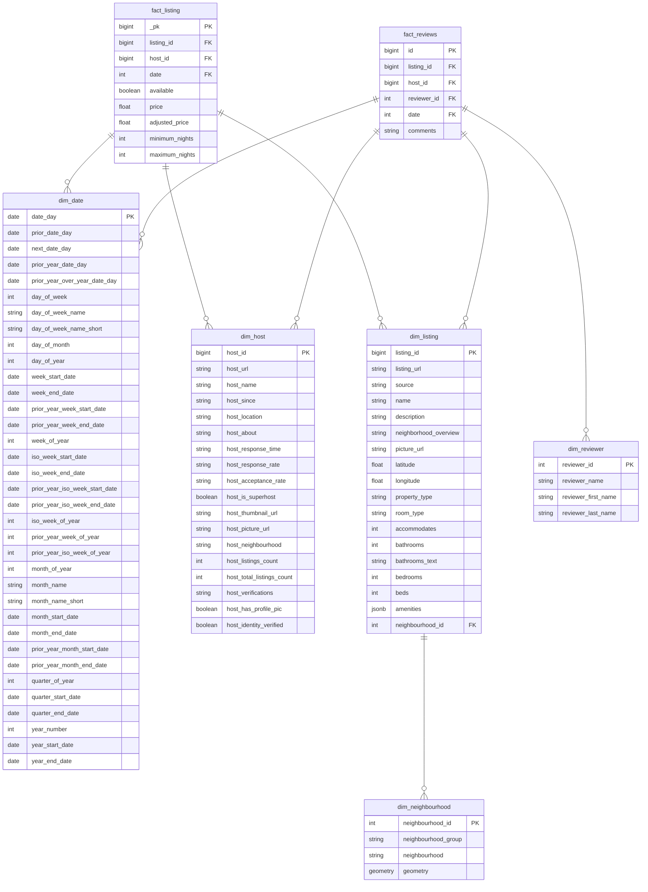
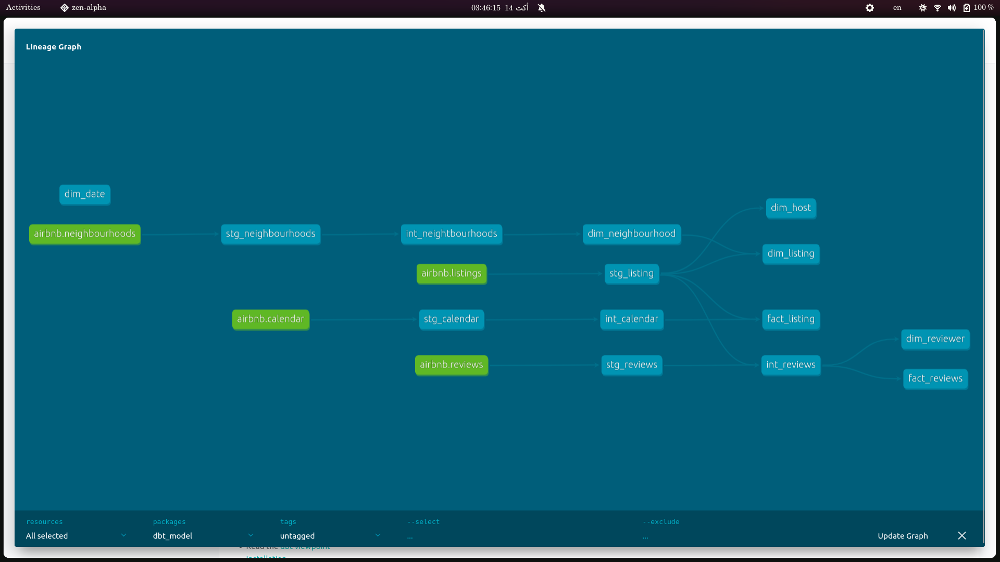

## Introduction
The primary goal of this project is to analyze Airbnb listings data for Barcelona, allowing us to construct a data warehouse (DW) that can efficiently support various business queries. By utilizing the dataset, we aim to extract insights that address specific business questions, enabling stakeholders to make informed decisions based on the data.                  
> For more information about this task, check [this repo](https://github.com/ahmedshaaban1999/Data_Engineering_Mentorship/tree/main/level_1/Data_Modeling/projects/airbnb) 

## Business Questions

To further guide the analysis, several specific business questions are posed, such as:

- **Identifying the cheapest**, **most available** listing in October 2024.
- **Determining which listings** received the most reviews in October 2024.
- **Identifying the most** expensive neighborhood in Barcelona.
- **Providing tailored recommendations** for specific user profiles based on their needs and budget.


## Key Deliverables

The project is structured around two key deliverables:

- **Data Warehouse Schema:** A well-defined schema that enables efficient data storage and retrieval.
- **Business Question Answers:** SQL queries that answer the specified business questions, providing insights and recommendations based on the data.                                     
> Check: `./notebook.ipynb` to see results.
    
## Prerequisites:
- Docker & Docker Compose installed
- Python 3.9+
- Linux os (Ubuntu 22.04.5 LTS x86_64 was used in this project)
- gunzip (gzip) 1.10

## How to run

To start, run `sh setup.sh` that handles the following tasks:

- **Data Directory Setup**: Creates a directory structure to organize raw data files.
- **Data Downloading:** Fetches essential CSV and GeoJSON files from the Inside Airbnb website, which includes listings, calendar data, reviews, and geographical data about neighborhoods.
- **Data Uncompression:** Decompresses the downloaded files for further processing.             

Subsequently, another script (`load_source_data.py`) is used to load this data into a PostgreSQL database. This script:

- **Reads** CSV files in chunks to avoid memory issues and processes each chunk before loading it into the database. Special handling is included for price fields to ensure they are stored in a numerical format.
- **Loads** GeoJSON files directly into the database as well, allowing spatial queries to be performed on geographical data.

### profiles.yml
Copy these configurations to your `profiles.yml` 
```yml
# /path/to/profiles.yml
dbt_model:
  outputs:
    dev:
      dbname: bnb
      host: localhost
      pass: passw0rd
      port: 5432
      schema: dwh
      threads: 1
      type: postgres
      user: ahmad
  target: dev
```

## DWH Schema
The schema is designed using an Entity-Relationship Diagram (ERD) that visually represents the relationships between the various tables in the data warehouse. This diagram serves as a blueprint for how data is organized and how different entities interact, making it easier for developers and analysts to understand the structure of the database.
- **Fact Tables**: These contain transactional data related to **listings** and **reviews**, allowing for performance-oriented querying.
- **Dimension Tables**: These provide context to the facts, such as details about hosts, listings, and dates. They enhance the analytical capabilities of the data warehouse by allowing more intuitive filtering and grouping in queries.




# Lineage Diagram
The lineage diagram provides a visual representation of the flow of data through various stages of the data pipeline, illustrating how raw data transforms into actionable insights within the data warehouse. It captures the relationships between different components, including data sources, transformations, and the final analytical outputs.
